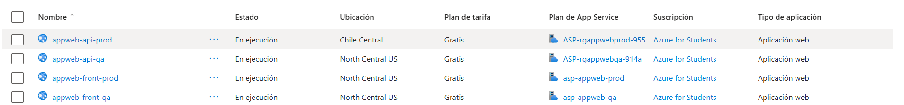
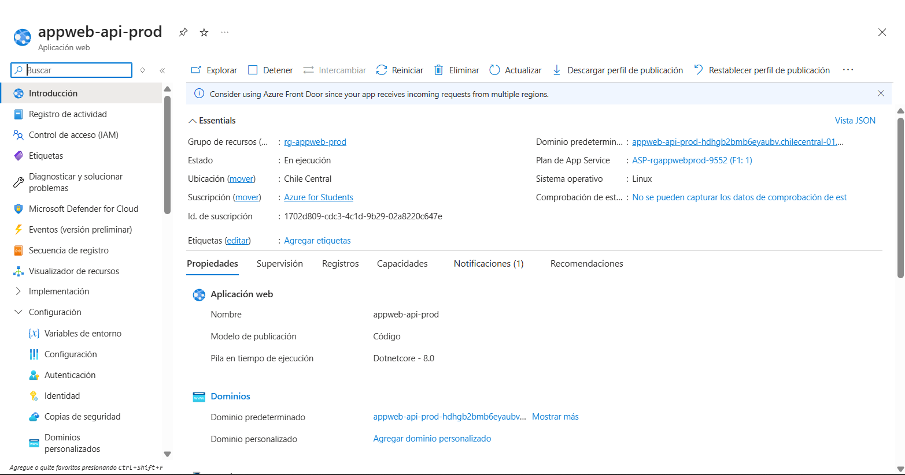
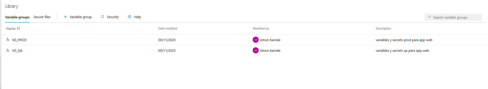
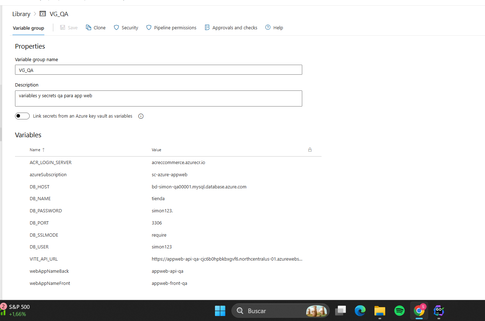
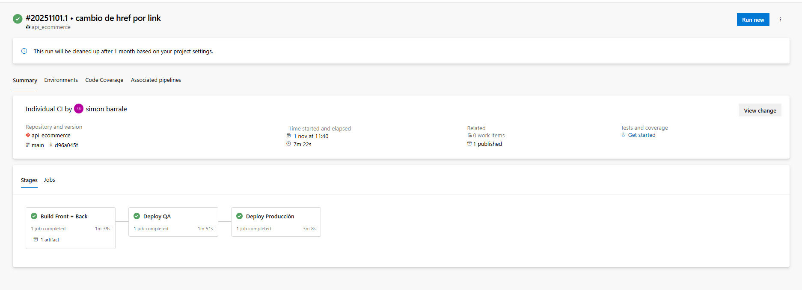
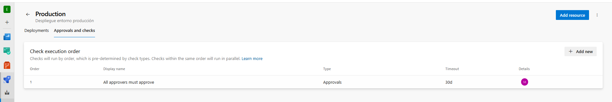

Trabajo práctico 5 - Ingeniería de Software
Alumnos: Barrale Simón y Monzo Vicente

Para este trabajo práctico creamos una aplicación ecommerce de venta de zapatillas, la creamos nosotros para tener mayor conocimiento de la estructura y poder ir haciendo retoques si es necesario.
Desarrollamos el Backend en Go y el Frontend en React+Vite, mientras que para la base de datos optamos por MySQL.

Ahora vamos con el desarrollo del trabajo práctico y las decisiones técnicas que fuimos tomando.
Para el punto 1 de configuración de Cloud Resources elegimos trabajar con Azure, trabajando todo sobre Azure Web Apps
Para poder utilizarlas primero creamos Resource Groups 1 para QA y otro para PROD.
También creamos 2 App Service Plan diferenciando uno para QA y otro para PROD.
Luego de esto, creamos las siguientes 4 web apps:

Donde cada web app tiene un fin específico, la appweb-api-prod nos sirve para el backend que desarrollamos en Golang y le dimos la siguiente configuración

Siguiendo está lógica hicimos las 3 appwebs para el frontend de producción, para el backend de QA y el frontend de QA.

Por otro lado creamos 2 servidores de MySQL en Azure, el recurso se llama Servidor Flexible de Azure Database for MySQL, una BD fue para almacenar los datos de QA y la otra fue para los datos de PROD.

Luego de esto, fuimos al pipeline con el que trabajamos en los trabajos prácticos anteriores y creamos 2 variables de entorno en Library, que nos va a servir para poder diferenciar los entornos en los Deploy

Por ejemplo tenemos la conexion a la base de datos con su host, puerto, usuario, password, url y demás.

Estas variables las usamos en el pipeline, por ejemplo al conectarnos a la base de datos de QA, en el stage de deploy QA
Código donde definimos el variable_group en el yml:
- stage: Deploy_QA
  displayName: "Deploy QA"
  dependsOn: Build
  variables:
  - group: VG_QA     # <- Variable Group QA

Luego para la conexión de BD:

Setear App Settings (DB, etc.) por si cambian
                - task: AzureAppServiceSettings@1
                  displayName: 'App Settings Backend QA'
                  inputs:
                    azureSubscription: 'sc-azure-appweb'

                    appName: '$(webAppNameBack)'
                    appSettings: |
                      [
                        {"name":"DB_HOST","value":"$(DB_HOST)","slotSetting":false},
                        {"name":"DB_PORT","value":"$(DB_PORT)","slotSetting":false},
                        {"name":"DB_NAME","value":"$(DB_NAME)","slotSetting":false},
                        {"name":"DB_USER","value":"$(DB_USER)","slotSetting":false},
                        {"name":"DB_PASSWORD","value":"$(DB_PASSWORD)","slotSetting":false},
                        {"name":"DB_SSLMODE","value":"$(DB_SSLMODE)","slotSetting":false},
                        {"name":"PORT","value":"8080","slotSetting":false}
                      ]

Al Pipeline lo definimos de la siguiente manera, lo dividimos en tres stages uno para Build, otro para Deploy_QA y otro para Deploy_PROD

En el stage de Build se hace el build de back, de front y se publican los artefactos creados para luego utilizarse en los Deploy.
Luego el stage de Deploy_QA se ejecuta automaticamente despues del build, donde se utilizan las variable_groups que creamos anteriormente.
Además agregamos los Health check de backend y frontend como pedia el enunciado para ver si el servidor se habia levantado de manera correcta, y detectar algun posible error y cortar el pipeline.
Por ejemplo este es el health check para el backend de producción:

Health check backend
- script: |
BACK_URL="https://appweb-api-qa-cjc6b0hpbkbxgvf6.northcentralus-01.azurewebsites.net/api/healthz"
echo "Checking $BACK_URL"
for i in {1..10}; do
code=$(curl -s -o /dev/null -w "%{http_code}" "$BACK_URL")
echo "Intento $i => $code"
if [ "$code" = "200" ]; then
exit 0
fi
sleep 5
done
echo "Health check backend FAILED"
exit 1
displayName: 'Health check Backend QA'

y este es para el frontend:
Health check frontend
                - script: |
                    FRONT_URL="https://appweb-front-qa-ctg3cwawggeag6g4.northcentralus-01.azurewebsites.net/"
                    echo "Checking $FRONT_URL"
                    for i in {1..10}; do
                      code=$(curl -s -o /dev/null -w "%{http_code}" "$FRONT_URL")
                      echo "Intento $i => $code"
                      if [ "$code" = "200" ]; then
                        exit 0
                      fi
                      sleep 5
                    done
                    echo "Health check frontend FAILED"
                    exit 1
                  displayName: 'Health check Frontend QA'

Luego de esto, para pasar al stage de Deploy_PROD configuramos una aprobación manual que hicimos la primera vez que corrimos el pipeline(no le sacamos captura en ese momento por eso no ponemos)
En el código tenemos el environment de Production, el cual pide aprobacion manual.
- stage: Deploy_Prod
  displayName: "Deploy Producción"
  dependsOn: Deploy_QA
  variables:
  - group: VG_PROD   # <- Variable Group PROD
  jobs:
  - deployment: ProdDeploy
  displayName: 'Deploy a Producción'
  environment: 'Production'   # <- este env tiene aprobación manual

