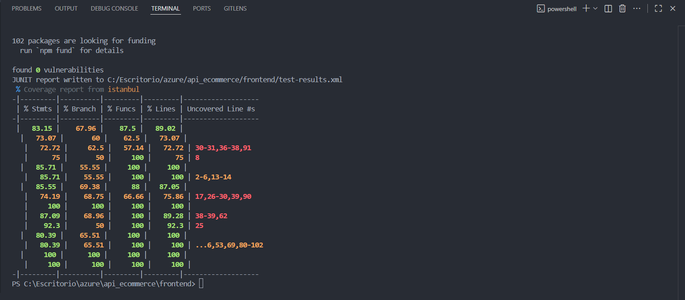
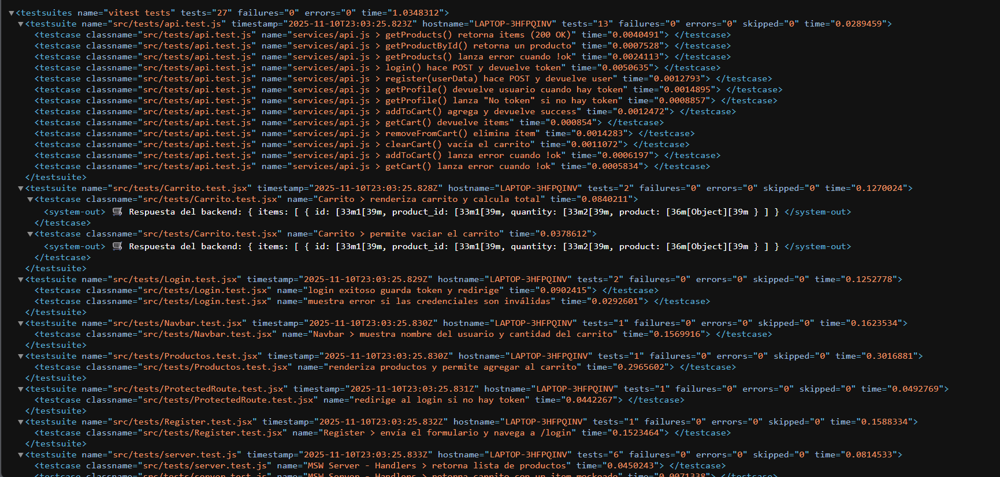
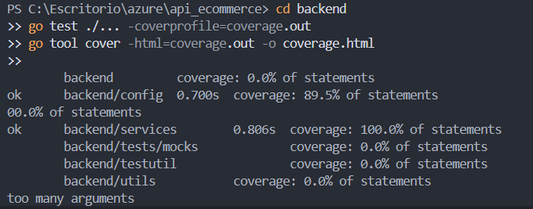
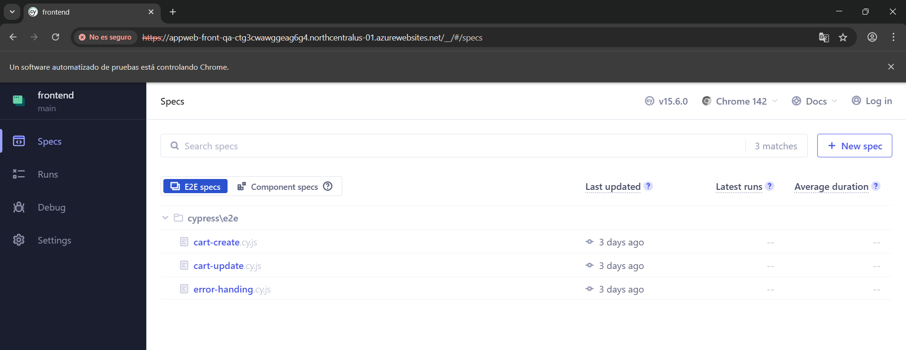
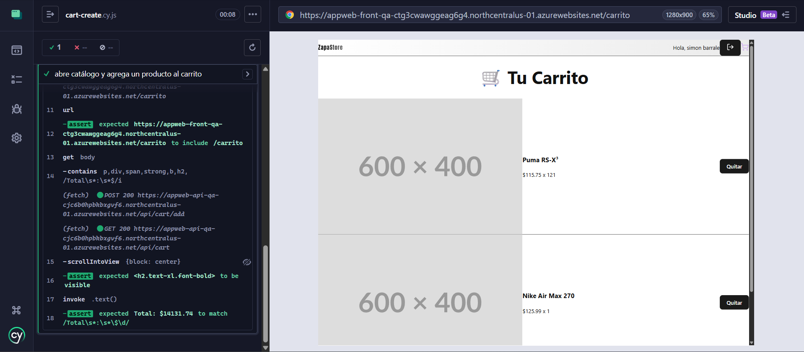
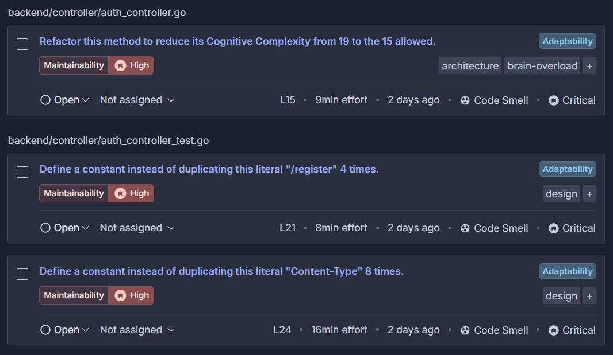
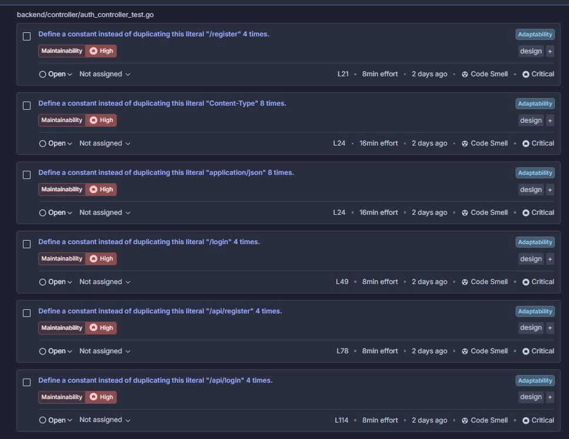
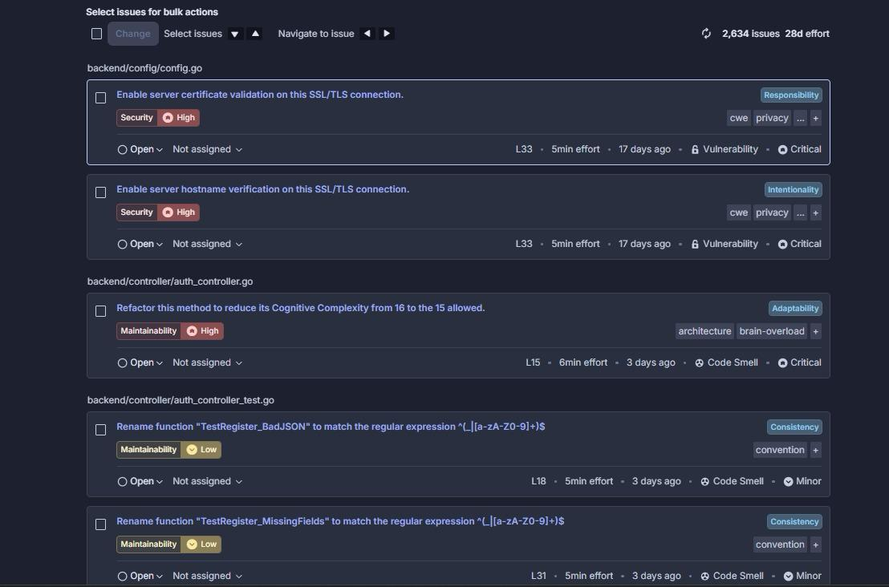
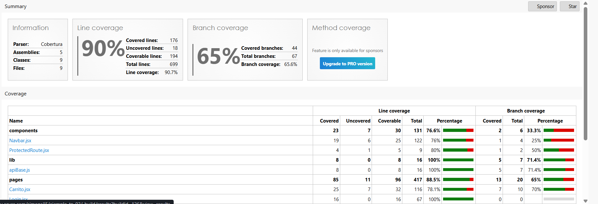
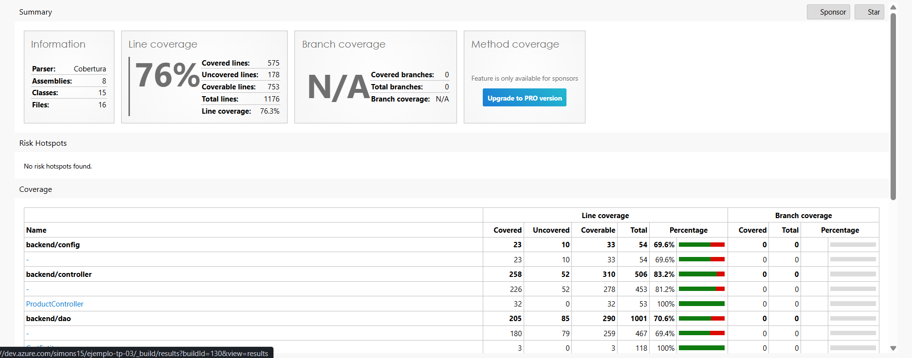

Trabajo Práctico 7 – Ingeniería de Software 3
Universidad Católica de Córdoba
Autores: Simón Barrale y Vicente Monzó

En este trabajo práctico implementamos un pipeline CI/CD  utilizando Azure DevOps.
El objetivo fue montar un proceso automático, similar al de una empresa real, que incluya:

- Pruebas unitarias de frontend (React + Vite + Vitest)
- Pruebas unitarias de backend (Go) con cobertura
- Pruebas end-to-end (Cypress)
- Análisis estático con SonarCloud
- Build del frontend y backend
- Deploy automático a QA
- Deploy con aprobación manual a Producción

#Etapa incial y las tecnologias que elegimos
    Paso 1 – Seleccionamos el mismo repositorio con el que veniamos trabajando del tp05
    esta conformado por un backend realizado con go y un fontend con react + vite. 
    Para el frontend utilizamos Vitest, porque se integra nativamente con Vite y es muy rápido.En el backend utilizamos las pruebas nativas de Go, que además permiten generar cobertura de manera simple. 
    Antes de correr el pipline en Azure, nos aseguramos que todo se pueda ejecutar de manera local, asi evitamos problemas con la integracion. 

#Para las pruebas automatizadas del frontend 
    Para el frontend configuramos tests unitarios con Vitest y mocks con MSW, lo cual nos permitió simular respuestas del backend sin depender de la API real. Además agregamos reporter JUnit (para que Azure DevOps pueda leer los resultados) y cobertura generada con Istanbul.
    El objetivo fue que cada push a la rama main valide automáticamente que el frontend no rompa funcionalidades básicas.

    cuando queremos ver los reportes/resultados de los test ejecutamos el siguiente comando: 
    npx vitest run --coverage --reporter=junit --outputFile
    Vitest generó dos artefactos importantes:
     - un archivo XML (test-results.xml) con los resultados de los tests (usado por Azure DevOps)
     - la carpeta de coverage en formato HTML y Cobertura
    
    Esto nos permitió ver métricas reales de calidad del código.
Imagen de las pruebas corriendo de manera local 

El resultado de los test en xml 

#Pruebas del backend con Go y cobertura

    En el backend aplicamos una estrategia parecida, pero aprovechando las herramientas propias del lenguaje. Las pruebas se ejecutaron con go test y utilizamos go-junit-report para transformar la salida en un reporte compatible con Azure DevOps. Para la cobertura generamos dos versiones:

    - cobertura.xml en formato Cobertura
    - coverage.html para inspección manual

    También excluimos paquetes de mocks o utilidades de test para evitar inflar artificialmente la cobertura.

#Pruebas End-To-End (Cypress)
    Además de las pruebas unitarias, agregamos una capa de pruebas end-to-end usando Cypress. Esta parte del pipeline ejecuta la aplicación directamente sobre el ambiente QA real, y simula interacciones del usuario: login, navegación entre productos, agregar al carrito, etc.

    Cypress produce videos y screenshots de cada ejecución, que subimos como artefactos del pipeline. Esto nos permitió ver visualmente qué estaba ocurriendo en caso de errores.

Inicio de nuestro cypress

TEST DE CREAR CARRITO (VA AL CATALOGO, AGREGA PRODUCTO Y CORROBORA EL TOTAL)

#Análisis estático con SonarCloud
    Para complementar las pruebas, integramos SonarCloud en el pipeline. Esto analiza:
    - vulnerabilidades
    - code smells
    - duplicación de código
    - bugs
    - cobertura combinada del proyecto

    Una decisión importante fue que la pipeline solo continúe si el “Quality Gate” está en verde. Esto replica procesos reales de calidad donde no se permite avanzar si el código no cumple estándares mínimos.

#Build del frontend y backend 
    Luego de validar el código, configuramos el stage de build.
    En el backend simplemente compilamos el ejecutable con Go.
    En el frontend usamos Vite, agregando la variable VITE_API_URL = https://appweb-api-qa.azurewebsites.net/api  para que cada build apunte al ambiente correcto (QA o Producción).

    El resultado fueron dos artefactos ZIP:
    - backend.zip
    - frontend.zip

    Estos archivos son reproducibles independientemente de en qué máquina se ejecuten, lo cual es clave en un pipeline profesional.  

#Deploy automático a QA
    QA se despliega automáticamente cuando los stages anteriores pasan correctamente. Osea los test, coverage y sonarcloud. Azure se despliega directamente.

    Creamos Variable Groups para QA, donde configuramos:
    - datos de la base de datos
    - credenciales
    - URLs
    - nombres de las Web Apps

    Luego usamos AzureWebApp@1 para enviar los ZIP al App Service correspondiente.
    Después del deploy, realizamos un healthcheck con un bucle que consulta /api/healthz.
    Si la API no responde 200 en un tiempo razonable, el pipeline falla.

#Deploy manual a Producción
    Para Producción optamos por un enfoque más conservador:
    el deploy no se ejecuta automáticamente. Azure DevOps pide una aprobación manual desde la sección Environments.

    Este mecanismo refleja cómo se manejan los despliegues reales, donde una persona supervisa que el QA esté funcionando antes de liberar la versión a los usuarios finales.

    El proceso de deploy en sí es igual al de QA, cambiando únicamente los valores del Variable Group de producción y la URL del backend.

#Conclusion 
    Como resultado obtuvimos na pipeline de CI/CD completo, con varias capas de pruebas, análisis estático y despliegues automáticos. Aprendimos como separar ambiente de Qa y de prod por medio de las Variable Groups, para mantener ambos ambientes completamente aislados. También incorporamos healthchecks para asegurar la confiabilidad de la aplicación luego del deploy.

    El resultado final es un pipeline profesional, claro y completamente automatizado. Es una experiencia que nos permite entender cómo se trabaja en la industria y que nos sirvió para integrar conocimientos de testing, calidad y despliegue continuo.

    Imagenes coverage en el pipeline de Azure 

