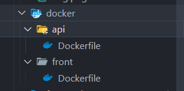
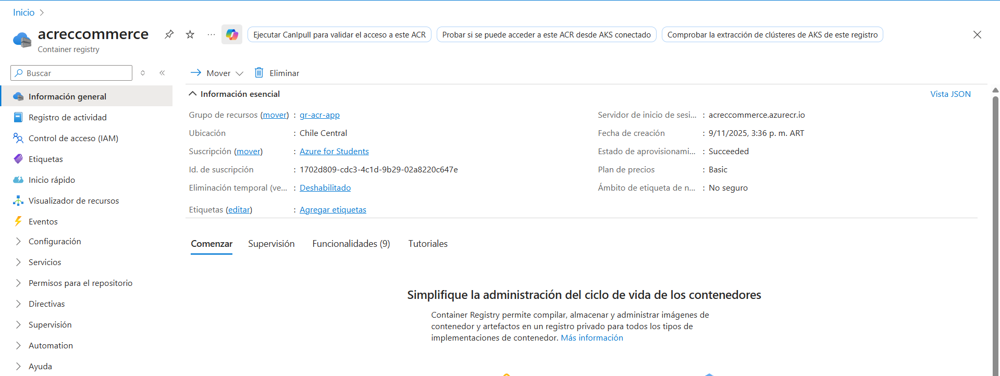
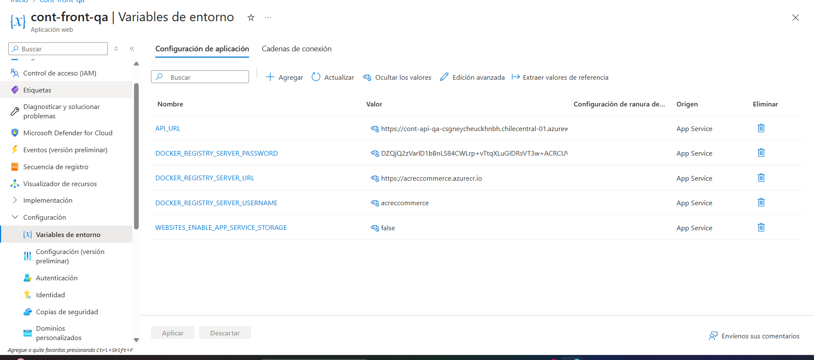
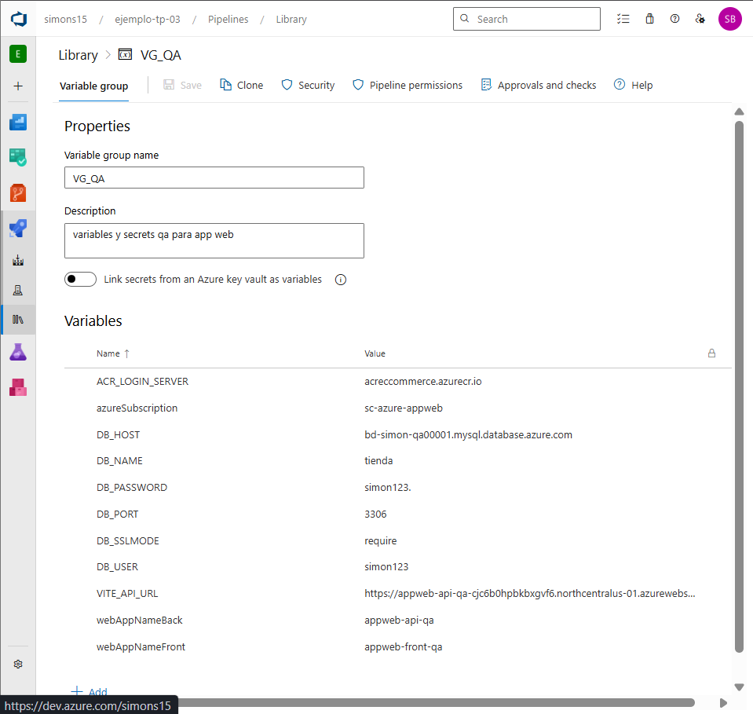

Ingeniería de Software 3 – Universidad Católica de Córdoba

Autores: Simón Barrale y Vicente Monzó

    En este trabajo práctico extendimos la arquitectura y el pipeline que desarrollamos en el TP07, integrando ahora contenedores Docker, Azure Container Registry (ACR) y despliegues automáticos de imágenes Docker a Azure App Service.
    El objetivo fue evolucionar desde un pipeline basado en archivos ZIP hacia uno completamente contenedorizado, similar al que utilizan empresas reales para separar entornos, versionar imágenes y automatizar deploys.

Para esto utilizamos el mismo proyecto de backend en Go y frontend en React + Vite, pero ahora empaquetado dentro de sus propios contenedores independientes.

Tecnologías seleccionadas y fundamentación
Decidimos continuar utilizando:
- Backend: Go + Gin
- Frontend: React + Vite
- Base de datos: Azure Database for MySQL Flexible Server
- CI/CD: Azure DevOps Pipelines
- ontenedores: Docker
- Registry: Azure Container Registry
- Hosting: Azure App Service (Linux + Docker)

    Elegimos App Service en lugar de Kubernetes porque la consigna pedía explícitamente trabajar con contenedores simples por ambiente, sin orquestadores complejos.

    También seleccionamos un ACR único para ambos ambientes, pero imágenes distintas para QA y Producción, lo que nos permitió mantener un verdadero pipeline multiambiente.

#Dockerización del Backend (Go)

    Para el backend escribimos un Dockerfile basado en multi-stage build, con el objetivo de generar imágenes más livianas y seguras.
    Primero compilamos la app en una imagen oficial de Go, y luego movimos únicamente el binario compilado a una imagen Alpine.

    Esto produce una imagen final muy pequeña y rápida de iniciar, lo cual es importante en App Service.

    Antes de integrarlo al pipeline lo probamos localmente con:
    - docker build -t backend-local .
    - docker run -p 8080:8080 backend-local

    De esa forma nos aseguramos que la app funcione sin depender del entorno del desarrollador.

#Dockerización del Frontend (React + Vite)

    El frontend necesitaba un servidor de archivos estático.
    Elegimos Nginx, que es estándar para producción.

    En el Dockerfile agregamos una build ARG (VITE_API_URL) para poder generar imágenes diferentes según el ambiente.
    QA compila con la API de QA y Producción compila con la API de Producción.

    También agregamos un nginx.conf con fallback a index.html, necesario para que las rutas del SPA funcionen correctamente.

    Probamos la imagen localmente y confirmamos que respondiera por el puerto 80.

#Creación del Azure Container Registry (ACR)
Creamos un registry llamado:

    acreccommerce

    Este recurso es donde se almacenan todas las imágenes generadas por el pipeline.
    Cada build crea cuatro imágenes nuevas:

        - backend QA
        - backend PROD
        - frontend QA
        - frontend PROD
{
Y cada imagen se versiona automáticamente con:
qa-$(Build.BuildId)
latest-qa
prod-$(Build.BuildId)
latest-prod

El uso de BuildId garantiza que todas las builds quedan registradas.
}
IMAGEN EN AZURE DEL ACR

#Web Apps para QA y Producción

    Creamos cuatro aplicaciones Web App en Azure App Service:

    ENTORNO --> TIPO       APLIACION
    QA -->	Backend  	    cont-api-qa
    QA -->	Frontend	    cont-front-qa
    PROD -->	Backend	    cont-api-prod
    PROD --->	Frontend	cont-front-prod

    Todas están configuradas para recibir imágenes Docker directamente desde ACR.

   

#Variable Groups para QA y Producción

    Creamos dos grupos:
    VG_QA

    Contiene:
    - Credenciales de la base de datos QA
    - Nombre del resource group
    - Datos del ACR
    - Nombre de las Web Apps de QA
    - VITE_API_URL_QA

    VG_PROD
    Con los datos equivalentes, pero apuntando a Producción.

    Esto permitió que el mismo pipeline tome decisiones distintas según el ambiente sin modificar el código.
VARIABLES DE ENTORNO DEL CONTENEDOR DEL FRONT DE QA

LIBRERIA DE AZURE QUE MUESTRA EL GRUPO DE VARIABLES

#Pipeline: Build & Push de Imágenes (TP08)

    Agregamos un stage nuevo al pipeline llamado Container_Build_Push que:
    - Hace login al ACR usando un service connection
    - Construye la imagen del backend
    - Construye dos imágenes del frontend (QA y PROD)
    - Pushea todas las imágenes al ACR
    - Versiona las imágenes automáticamente

    El proceso es completamente automático.
    Apenas se hace un push a la rama main, el pipeline:

    - obtiene el commit
    -  genera cuatro imágenes nuevas
    -  las envía al ACR
    -  deja todo listo para desplegar QA y PROD

#Deploy automático a QA (contenedores)

    Una vez generadas las imágenes, el pipeline actualiza directamente las Web Apps seleccionadas para QA.

    Usamos Azure CLI para:

    - asignar la imagen correcta a la Web App
    - actualizar variables de entorno
    - configurar el puerto del contenedor (WEBSITES_PORT)
    - reiniciar la app automáticamente

    Luego hacemos un health check contra:

    https://cont-api-qa.azurewebsites.net/api/healthz

    El pipeline solo continúa si devuelve HTTP 200.
    Si falla, la pipeline marca el deploy como fallido.

    Deploy manual a Producción

    A diferencia de QA, Producción requiere aprobación manual, tal como se hace en empresas reales.

    La etapa Deploy_Prod se ejecuta únicamente cuando una persona aprueba el release desde Azure DevOps Environments.

    Una vez aprobado, el proceso es similar:
    - establece la imagen correcta de PROD
    - actualiza variables
    - reinicia la Web App
    - realiza healthchecks finales

    Este mecanismo garantiza que Producción sea estable y controlada.

#Conclusiones
El TP08 nos permitió consolidar todo lo trabajado en los trabajos prácticos anteriores, dando un salto significativo hacia una arquitectura profesional basada en contenedores.

